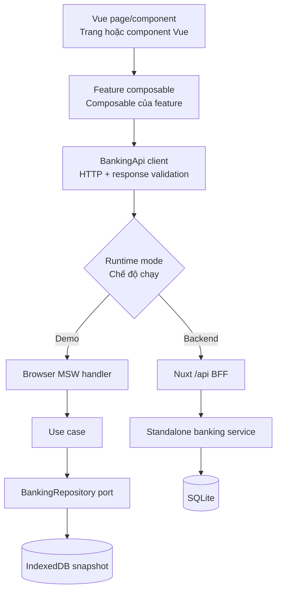
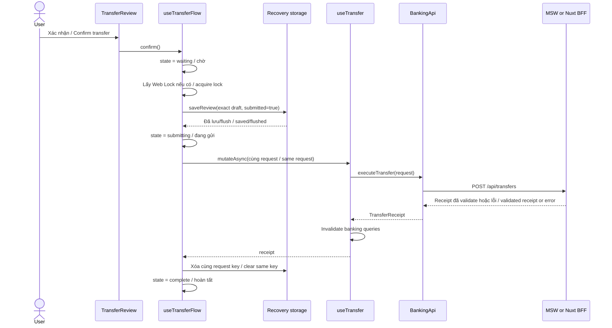
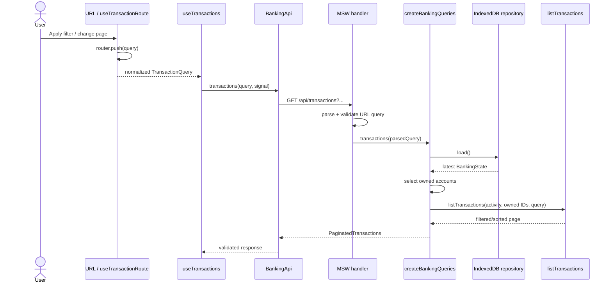

# Transfer & Transaction flow / Luồng Transfer & Transaction

> Tài liệu song ngữ này mô tả **code hiện tại** của `personal-finance-lab`, từ thao tác trên UI đến HTTP, use case và persistence. Ứng dụng có hai chế độ: demo chạy bằng browser MSW + IndexedDB, và backend chạy qua Nuxt BFF đến service `personal-finance-api`.
>
> This bilingual document describes the **current implementation** of `personal-finance-lab`, from UI actions through HTTP, use cases, and persistence. The application has two modes: a browser MSW + IndexedDB demo, and a backend mode that goes through the Nuxt BFF to `personal-finance-api`.

## 1. Khái niệm cần phân biệt / Important distinction

- **Transfer** là lệnh chuyển tiền (write command). Nó có request riêng, validation, idempotency key, thay đổi số dư và tạo receipt.
- **Transaction** là một dòng activity của account (read model). Trang Transactions chỉ đọc, lọc và phân trang các dòng này.
- Một transfer thành công sẽ tạo transaction activity. Không có `POST /transactions` trong frontend repo này.

---

- A **Transfer** is a money-movement write command. It has its own request, validation, idempotency key, balance changes, and receipt.
- A **Transaction** is an account activity row, used as a read model. The Transactions page only reads, filters, and paginates these rows.
- A successful transfer creates transaction activity. There is no `POST /transactions` in this frontend repository.

| Transfer destination / Đích chuyển tiền                               | Banking state change / Thay đổi dữ liệu   | Activity created / Transaction được tạo |
| --------------------------------------------------------------------- | ----------------------------------------- | --------------------------------------- |
| Another owned account / Tài khoản khác cùng chủ                       | Debit source, credit destination          | One debit + one credit                  |
| Another customer's internal account / Tài khoản nội bộ của người khác | Debit source, credit internal destination | One debit + one credit                  |
| External account / Tài khoản ngân hàng ngoài                          | Debit source only in this demo            | One debit                               |

## 2. Kiến trúc chung / Shared architecture

UI chỉ gọi typed `BankingApi`; UI không gọi repository hoặc use case trực tiếp. Boundary này được khai báo tại [`src/contracts/banking.ts`](../src/contracts/banking.ts) và được inject bởi [`src/plugins/01.banking.ts`](../src/plugins/01.banking.ts).

The UI calls only the typed `BankingApi`; it never calls a repository or use case directly. This boundary is declared in [`src/contracts/banking.ts`](../src/contracts/banking.ts) and injected by [`src/plugins/01.banking.ts`](../src/plugins/01.banking.ts).



### Session và request scope / Session and request scope

1. [`src/plugins/01.banking.ts`](../src/plugins/01.banking.ts) đọc runtime mode, tạo request-scoped `BankingApi`, `BankingSession`, recovery adapter và inject `BankingContext`.
2. [`src/data/api/sessionBankingApi.ts`](../src/data/api/sessionBankingApi.ts) bao mọi operation bằng `session.run()`. Response của session generation cũ sẽ bị loại bỏ.
3. Query keys có dạng `['bank', customerId, sessionGeneration, ...resource]`, được tạo tại [`src/data/api/bankingQueryKeys.ts`](../src/data/api/bankingQueryKeys.ts). Vì vậy cache của hai identity/session không dùng lẫn nhau.
4. Demo mode chỉ bật query sau khi MSW khởi động ở browser. Backend mode có thể prefetch khi SSR.

---

1. [`src/plugins/01.banking.ts`](../src/plugins/01.banking.ts) reads the runtime mode, creates a request-scoped `BankingApi`, `BankingSession`, and recovery adapter, then injects `BankingContext`.
2. [`src/data/api/sessionBankingApi.ts`](../src/data/api/sessionBankingApi.ts) wraps every operation in `session.run()`. A response from an old session generation is discarded.
3. Query keys have the shape `['bank', customerId, sessionGeneration, ...resource]`, built by [`src/data/api/bankingQueryKeys.ts`](../src/data/api/bankingQueryKeys.ts). This prevents identities or sessions from sharing cached banking data.
4. Demo-mode queries are enabled only after browser MSW startup. Backend mode can prefetch during SSR.

## 3. Transfer flow / Luồng chuyển tiền

### 3.1 Entry: mở trang Transfer / Opening the Transfer page

Entry point là [`src/pages/transfer.vue`](../src/pages/transfer.vue).

The entry point is [`src/pages/transfer.vue`](../src/pages/transfer.vue).

Khi page setup chạy:

1. `useAccounts()` gọi `api.accounts()` để lấy source/own destination accounts.
2. `useBeneficiaries()` gọi `api.beneficiaries()` để lấy saved recipients.
3. `useTransferFlow()` tạo state machine cho ba stage `DETAILS -> REVIEW -> COMPLETE` và khôi phục draft cũ nếu có.
4. Trong lúc account/beneficiary chưa có, `DataState` hiển thị loading/error/empty. Form chỉ mount khi cả hai query đã có data.

When page setup runs:

1. `useAccounts()` calls `api.accounts()` for source and own-destination accounts.
2. `useBeneficiaries()` calls `api.beneficiaries()` for saved recipients.
3. `useTransferFlow()` creates the `DETAILS -> REVIEW -> COMPLETE` state machine and restores a saved draft when present.
4. While account or beneficiary data is unavailable, `DataState` renders loading/error/empty states. The form mounts only after both queries have data.

### 3.2 Nhập details và kiểm tra recipient / Entering details and checking a recipient

Form nằm tại [`src/features/transfers/components/TransferDetailsForm.vue`](../src/features/transfers/components/TransferDetailsForm.vue).

The form lives in [`src/features/transfers/components/TransferDetailsForm.vue`](../src/features/transfers/components/TransferDetailsForm.vue).

- `TransferDetails` là state thân thiện với form: amount vẫn là decimal string, recipient có các field đang nhập, và chưa phải API request.
- `transferDetailsSchema()` trong [`src/features/transfers/transferDraft.ts`](../src/features/transfers/transferDraft.ts) kiểm tra source active, destination hợp lệ, currency khớp, account number 8–20 chữ số, amount dương/tối đa 2 chữ số thập phân và không vượt balance đang hiển thị.
- Với recipient cùng Demo Bank được nhập mới, nút kiểm tra gọi `api.lookupRecipient(accountNumber)` qua `GET /api/recipient-accounts/:accountNumber`. Kết quả xác nhận name/account trước khi Review.
- Mỗi thay đổi phát event `change`. `useTransferFlow.changed()` debounce việc lưu `DETAILS` recovery; đây chỉ là draft, không thay đổi banking state.

---

- `TransferDetails` is form-friendly state: the amount is still a decimal string, recipient fields are editable, and it is not yet an API request.
- `transferDetailsSchema()` in [`src/features/transfers/transferDraft.ts`](../src/features/transfers/transferDraft.ts) validates an active source, a valid destination, matching currency, an 8–20 digit account number, a positive amount with at most two decimal places, and the currently displayed available balance.
- For a newly entered Demo Bank recipient, the check action calls `api.lookupRecipient(accountNumber)` through `GET /api/recipient-accounts/:accountNumber`. The result verifies the name/account before Review.
- Every edit emits `change`. `useTransferFlow.changed()` debounces saving a `DETAILS` recovery record; this is only a draft and does not mutate banking state.

### 3.3 Từ form thành request snapshot / From form state to a request snapshot

Khi UForm submit action **Review**:

1. `TransferDetailsForm.review()` gọi `prepareTransfer()`.
2. `prepareTransfer()` validate lại toàn bộ details.
3. `decimalToMinor()` đổi chuỗi tiền sang integer minor units, ví dụ `"10.50" -> 1050`. Không dùng phép nhân floating-point để tính cents.
4. `crypto.randomUUID()` sinh một `idempotencyKey` mới.
5. Destination được map thành một trong ba request shapes: `OWN_ACCOUNT`, `BENEFICIARY`, hoặc `NEW_BENEFICIARY`.
6. Kết quả là `TransferDraft`, giữ `request` snapshot để submit và dữ liệu thân thiện với UI cho Review/recovery. Flow xem request này là không đổi và tái sử dụng nguyên vẹn khi retry; TypeScript type không enforce `readonly` và object không bị `Object.freeze()`.

When the UForm **Review** action submits:

1. `TransferDetailsForm.review()` calls `prepareTransfer()`.
2. `prepareTransfer()` validates the complete details again.
3. `decimalToMinor()` converts decimal text into integer minor units, for example `"10.50" -> 1050`. It does not calculate cents with floating-point multiplication.
4. `crypto.randomUUID()` creates a new `idempotencyKey`.
5. The destination maps to one of three request shapes: `OWN_ACCOUNT`, `BENEFICIARY`, or `NEW_BENEFICIARY`.
6. The result is a `TransferDraft`, containing both the request snapshot for submission and UI-friendly data for Review and recovery. The flow treats that request as unchanged and reuses it exactly for a retry; the TypeScript type does not enforce `readonly`, and the object is not frozen with `Object.freeze()`.

Public request contract nằm tại [`src/contracts/transfers.ts`](../src/contracts/transfers.ts):

The public request contract is in [`src/contracts/transfers.ts`](../src/contracts/transfers.ts):

```ts
interface TransferRequest {
  idempotencyKey: string
  sourceAccountId: string
  destination:
    | { kind: 'OWN_ACCOUNT'; accountId: string }
    | { kind: 'BENEFICIARY'; beneficiaryId: string }
    | {
        kind: 'NEW_BENEFICIARY'
        beneficiary: CreateBeneficiaryRequest
        saveRecipient?: boolean
      }
  amountMinor: number
  currency: 'USD'
  reference?: string
}
```

### 3.4 Review chưa chuyển tiền / Review does not move money

`useTransferFlow.review(draft)` trong [`src/features/transfers/composables/useTransferFlow.ts`](../src/features/transfers/composables/useTransferFlow.ts):

1. Dừng autosave của details.
2. Gọi `saveReview(storageKey, draft, false)`.
3. Chỉ khi recovery save thành công mới đổi state sang `review`.
4. [`TransferReview.vue`](../src/features/transfers/components/TransferReview.vue) chỉ render snapshot và phát `back` hoặc `confirm`.

`Review` không gọi transfer endpoint, không debit balance, không lưu beneficiary và không tạo transaction.

---

`useTransferFlow.review(draft)` in [`src/features/transfers/composables/useTransferFlow.ts`](../src/features/transfers/composables/useTransferFlow.ts):

1. Stops the details autosave.
2. Calls `saveReview(storageKey, draft, false)`.
3. Changes state to `review` only after recovery persistence succeeds.
4. [`TransferReview.vue`](../src/features/transfers/components/TransferReview.vue) only renders the snapshot and emits `back` or `confirm`.

`Review` does not call the transfer endpoint, debit a balance, save a beneficiary, or create transaction activity.

### 3.5 Confirm và request lifecycle / Confirm and request lifecycle



`confirm()` có các guard sau:

- Chỉ chạy từ `review` hoặc `uncertain`; double click khi đang chờ không tạo submit mới.
- Nếu browser hỗ trợ `navigator.locks`, lock `personal-finance-lab-transfer-confirm` serialize confirmation giữa các tab.
- Exact draft cùng idempotency key được đánh dấu `submitted: true` trước khi gửi. Nếu save/flush recovery thất bại thì request không được gửi.
- Session generation và local flow generation được kiểm tra trước/sau async work. Kết quả từ session cũ không được áp vào UI mới.
- Mutation có `retry: false`; retry sau uncertain outcome phải do user bấm và luôn dùng request/key cũ.

---

`confirm()` applies these guards:

- It runs only from `review` or `uncertain`; a double click while waiting cannot create another submission.
- When supported, the browser-wide `navigator.locks` lock named `personal-finance-lab-transfer-confirm` serializes confirmation across tabs.
- The exact draft and idempotency key are marked `submitted: true` before sending. If recovery save/flush fails, no request is sent.
- The session generation and local flow generation are checked before and after asynchronous work. Results from an old session are not applied to the new UI.
- The mutation has `retry: false`; retrying an uncertain outcome must be an explicit user action and must use the original request/key.

### 3.6 HTTP client boundary / HTTP client boundary

`useTransfer()` tại [`src/features/transfers/composables/useTransfer.ts`](../src/features/transfers/composables/useTransfer.ts) gọi `api.executeTransfer(request)`.

`useTransfer()` in [`src/features/transfers/composables/useTransfer.ts`](../src/features/transfers/composables/useTransfer.ts) calls `api.executeTransfer(request)`.

Luồng client cụ thể:

1. `createSessionBankingApi.executeTransfer()` flush recovery backend mirror nếu đang ở BFF mode, rồi xác nhận session vẫn current.
2. `createBankingApi.executeTransfer()` serialize JSON và gửi `POST /api/transfers`.
3. [`src/data/api/bankingResponseSchemas.ts`](../src/data/api/bankingResponseSchemas.ts) parse response bằng `transferReceiptResponseSchema` trước khi cho dữ liệu vào app state.
4. Response success malformed được xem là **unknown outcome** (`502 INVALID_RESPONSE`), không được xem là transfer chắc chắn thất bại.

The concrete client path is:

1. `createSessionBankingApi.executeTransfer()` flushes the backend recovery mirror in BFF mode, then verifies that the session is still current.
2. `createBankingApi.executeTransfer()` serializes JSON and sends `POST /api/transfers`.
3. [`src/data/api/bankingResponseSchemas.ts`](../src/data/api/bankingResponseSchemas.ts) parses the response with `transferReceiptResponseSchema` before it enters application state.
4. A malformed success response is treated as an **unknown outcome** (`502 INVALID_RESPONSE`), not as a definite transfer rejection.

### 3.7 Demo branch: MSW -> use case -> IndexedDB

Trong demo mode, request không đi tới Nitro. Browser service worker intercept `POST /api/transfers` và chạy handler tại [`src/data/mock/handlers/banking.ts`](../src/data/mock/handlers/banking.ts).

In demo mode, the request does not reach Nitro. The browser service worker intercepts `POST /api/transfers` and runs the handler in [`src/data/mock/handlers/banking.ts`](../src/data/mock/handlers/banking.ts).

Handler thực hiện:

1. Parse JSON bằng strict [`transferRequestSchema`](../src/data/api/transferRequestSchema.ts). Invalid body trả `400 INVALID_REQUEST`.
2. Gọi `executeTransfer(repository, parsed.data)` tại [`src/use-cases/transfers/executeTransfer.ts`](../src/use-cases/transfers/executeTransfer.ts).
3. Bỏ private fields `idempotencyKey` và `requestHash` khỏi public receipt.
4. Map `DomainError -> 422`, idempotency conflict `-> 409`, repository unavailable `-> 503`, và lỗi còn lại `-> 500`.

The handler:

1. Parses JSON with the strict [`transferRequestSchema`](../src/data/api/transferRequestSchema.ts). An invalid body returns `400 INVALID_REQUEST`.
2. Calls `executeTransfer(repository, parsed.data)` in [`src/use-cases/transfers/executeTransfer.ts`](../src/use-cases/transfers/executeTransfer.ts).
3. Removes private `idempotencyKey` and `requestHash` fields from the public receipt.
4. Maps `DomainError -> 422`, idempotency conflict `-> 409`, unavailable repository `-> 503`, and remaining errors `-> 500`.

#### `executeTransfer()` làm gì / What `executeTransfer()` does

Trước atomic update:

1. `structuredClone(input)` để caller không thể sửa request trong lúc hash async.
2. Validate key/reference cơ bản và normalize reference.
3. Tạo canonical payload và SHA-256 `requestHash`.
4. Sinh candidate `transferId` và `beneficiaryId`.

Before the atomic update:

1. `structuredClone(input)` prevents the caller from changing the request during asynchronous hashing.
2. It validates the key/reference and normalizes the reference.
3. It creates a canonical payload and SHA-256 `requestHash`.
4. It creates candidate `transferId` and `beneficiaryId` values.

Trong `repository.update(current => ...)`:

1. Tìm transfer cũ theo `idempotencyKey`.
   - Cùng key + cùng hash: không ghi lại; trả transfer/receipt cũ.
   - Cùng key + khác hash: throw `IDEMPOTENCY_CONFLICT`; không đổi state.
2. Resolve source và destination từ **snapshot mới nhất nằm trong transaction**.
3. Nếu là new beneficiary, `saveBeneficiary()` hoặc `resolveBeneficiary()` chạy trong cùng callback tùy `saveRecipient`.
4. `validateTransfer()` kiểm tra ownership, account status, currency, different destination, funds và arithmetic safety.
5. Debit source; credit destination nếu đích là account nội bộ.
6. Tạo `Transfer` với status `COMPLETED`.
7. Tạo debit `Transaction`; nếu có local target thì tạo thêm credit `Transaction`. Cả hai dùng cùng `transferId`.
8. Push transfer vào `state.transfers`, rồi trả snapshot mới.

Inside `repository.update(current => ...)`:

1. It finds an existing transfer by `idempotencyKey`.
   - Same key + same hash: write nothing and return the original transfer/receipt.
   - Same key + different hash: throw `IDEMPOTENCY_CONFLICT` without changing state.
2. It resolves the source and destination from the **latest snapshot inside the transaction**.
3. For a new beneficiary, `saveBeneficiary()` or `resolveBeneficiary()` runs in the same callback according to `saveRecipient`.
4. `validateTransfer()` checks ownership, account status, currency, a different destination, available funds, and arithmetic safety.
5. It debits the source and credits the destination when the destination is an internal account.
6. It creates a `Transfer` with status `COMPLETED`.
7. It creates a debit `Transaction` and, for a local target, a credit `Transaction`. Both reference the same `transferId`.
8. It appends the transfer to `state.transfers` and returns the next snapshot.

[`src/data/repositories/indexedDbBankingRepository.ts`](../src/data/repositories/indexedDbBankingRepository.ts) giữ một versioned snapshot gồm customer, accounts, transactions, transfers và beneficiaries. `update()` đọc snapshot mới nhất, chạy callback đồng bộ, validate toàn bộ snapshot bằng [`bankingStateSchema.ts`](../src/data/repositories/bankingStateSchema.ts), ghi một lần và chỉ resolve sau `IDBTransaction.oncomplete`. Callback throw, schema fail hoặc write abort đều giữ nguyên committed state cũ.

[`src/data/repositories/indexedDbBankingRepository.ts`](../src/data/repositories/indexedDbBankingRepository.ts) stores one versioned snapshot containing customer, accounts, transactions, transfers, and beneficiaries. `update()` reads the latest snapshot, runs the synchronous callback, validates the full snapshot with [`bankingStateSchema.ts`](../src/data/repositories/bankingStateSchema.ts), performs one write, and resolves only after `IDBTransaction.oncomplete`. A callback error, schema failure, or aborted write preserves the previous committed state.

### 3.8 Backend branch: Browser -> Nuxt BFF -> standalone service

Trong backend mode, cùng request `POST /api/transfers` đi theo chuỗi sau:

1. Browser client thêm `X-Banking-User` và `X-CSRF-Token` trong [`src/plugins/01.banking.ts`](../src/plugins/01.banking.ts).
2. Catch-all Nitro route [`server/api/[...path].ts`](../server/api/[...path].ts) chọn BFF handler và đặt `Cache-Control: private, no-store`.
3. [`server/utils/bffHandler.ts`](../server/utils/bffHandler.ts) kiểm tra BFF session, exact Origin, CSRF token và expected customer header. Browser-supplied `Authorization` không được tin cậy.
4. BFF refresh backend token **trước** dispatch nếu cần. Mutation chỉ được dispatch một lần; BFF không replay transfer sau refresh.
5. [`server/utils/bffHttpBackend.ts`](../server/utils/bffHttpBackend.ts) forward JSON đến `${NUXT_BFF_API_BASE_URL}/transfers` với server-held `Authorization: Bearer ...`.
6. Standalone `personal-finance-api` chịu trách nhiệm authorization, durable recovery/idempotency và atomic SQLite persistence. Code đó nằm ở sibling repository, không nằm trong repo tài liệu này.

In backend mode, the same `POST /api/transfers` request follows this chain:

1. The browser client adds `X-Banking-User` and `X-CSRF-Token` in [`src/plugins/01.banking.ts`](../src/plugins/01.banking.ts).
2. The catch-all Nitro route [`server/api/[...path].ts`](../server/api/[...path].ts) selects the BFF handler and sets `Cache-Control: private, no-store`.
3. [`server/utils/bffHandler.ts`](../server/utils/bffHandler.ts) validates the BFF session, exact Origin, CSRF token, and expected-customer header. A browser-supplied `Authorization` header is not trusted.
4. The BFF refreshes the backend token **before** dispatch when necessary. A mutation is dispatched once; the BFF does not replay a transfer after refresh.
5. [`server/utils/bffHttpBackend.ts`](../server/utils/bffHttpBackend.ts) forwards JSON to `${NUXT_BFF_API_BASE_URL}/transfers` with the server-held `Authorization: Bearer ...`.
6. The standalone `personal-finance-api` owns authorization, durable recovery/idempotency, and atomic SQLite persistence. That implementation is in the sibling repository, not in this documented repository.

### 3.9 Success, failure và recovery / Success, failure, and recovery

| Outcome / Kết quả                               | UI state / Trạng thái UI                                                                                      | Recovery behavior / Hành vi recovery                                                          | Cache behavior / Cache                                                                        |
| ----------------------------------------------- | ------------------------------------------------------------------------------------------------------------- | --------------------------------------------------------------------------------------------- | --------------------------------------------------------------------------------------------- |
| Receipt hợp lệ / Valid receipt                  | `complete` / hoàn tất                                                                                         | Xóa record có cùng request key / Clear the record for the same key                            | Cancel và invalidate mọi query `['bank']` / Cancel and invalidate all `['bank']` queries      |
| HTTP 400/422                                    | Về `review` với lỗi chắc chắn / Return to `review` with a definite failure                                    | Lưu `submitted:false`; cho phép sửa/quay lại / Save as not submitted; editing/Back is allowed | Refresh Accounts vì balance có thể cũ / Refresh Accounts because available funds may be stale |
| HTTP 409 `IDEMPOTENCY_CONFLICT`                 | `conflict`; thay Retry bằng link Transactions / `conflict`; replace Retry with the Transactions link          | Giữ conflict record/key qua reload / Retain the conflict record/key across reload             | Invalidate mọi banking query / Invalidate all banking queries                                 |
| Network/503/502 malformed success/unknown error | `uncertain`; khóa Back; nút thành “Retry same transfer” / `uncertain`; disable Back; relabel the retry button | Giữ nguyên submitted request/key / Retain the exact submitted request/key                     | Không tự retry mutation / Never retry the mutation automatically                              |
| Session đổi khi đang chờ / Session changes      | Bỏ kết quả cũ / Discard the old result                                                                        | Áp dụng cleanup theo identity / Apply identity-scoped cleanup rules                           | Cache session cũ được tách/xóa / Separate or clear the old session cache                      |

Recovery implementation nằm tại [`src/features/transfers/transferRecovery.ts`](../src/features/transfers/transferRecovery.ts):

- Key có scope theo mode và owner: `personal-finance-lab-transfer-v1:{demo|backend}:{owner}` (prefix được centralize trong sync config).
- Disposable draft hết hạn sau 24 giờ.
- Record `submitted` hoặc `conflict` không tự hết hạn vì có thể cần reconciliation.
- Reload chỉ restore; **không tự submit**.
- Demo dùng browser storage. Backend dùng [`sessionRecovery.ts`](../src/features/transfers/sessionRecovery.ts) để mirror `/api/recovery` vào memory-backed synchronous Storage interface và flush theo thứ tự trước transfer.

Recovery is implemented in [`src/features/transfers/transferRecovery.ts`](../src/features/transfers/transferRecovery.ts):

- Keys are scoped by mode and owner: `personal-finance-lab-transfer-v1:{demo|backend}:{owner}` (the prefix is centralized in sync configuration).
- Disposable drafts expire after 24 hours.
- `submitted` or `conflict` records do not expire automatically because they may require reconciliation.
- Reload only restores state; it **never submits automatically**.
- Demo mode uses browser storage. Backend mode uses [`sessionRecovery.ts`](../src/features/transfers/sessionRecovery.ts) to mirror `/api/recovery` into a memory-backed synchronous Storage interface and flush writes in order before a transfer.

Sau success, [`TransferReceipt.vue`](../src/features/transfers/components/TransferReceipt.vue) hiển thị validated receipt. `useTransfer.onSuccess()` cancel các banking query đang chạy rồi invalidate toàn bộ banking queries. Query đang active (thường là Accounts và Beneficiaries trên trang Transfer) sẽ refetch; query inactive như một Transactions filter/page đã cache chỉ được đánh dấu stale và fetch khi active trở lại.

After success, [`TransferReceipt.vue`](../src/features/transfers/components/TransferReceipt.vue) renders the validated receipt. `useTransfer.onSuccess()` cancels in-flight banking queries and invalidates all banking queries. Active queries—normally Accounts and Beneficiaries on the Transfer page—refetch; an inactive cached query such as a Transactions filter/page is marked stale and fetches when it becomes active again.

## 4. Transaction flow / Luồng lịch sử giao dịch

### 4.1 Entry và URL state / Entry and URL state

Entry point là [`src/pages/transactions.vue`](../src/pages/transactions.vue). Page compose ba phần chính:

- `useTransactionRoute()` sở hữu applied filters và pagination trong URL.
- `useAccounts()` lấy account metadata để render tên account và filter options.
- `useTransactions(query)` thực hiện data query.

The entry point is [`src/pages/transactions.vue`](../src/pages/transactions.vue). The page composes three main pieces:

- `useTransactionRoute()` owns applied filters and pagination in the URL.
- `useAccounts()` loads account metadata for account names and filter options.
- `useTransactions(query)` performs the data query.

[`src/features/transactions/composables/useTransactionRoute.ts`](../src/features/transactions/composables/useTransactionRoute.ts) đọc các key:

`query`, `accountId`, `direction`, `type`, `status`, `dateFrom`, `dateTo`, `page`, `pageSize`.

[`src/features/transactions/composables/useTransactionRoute.ts`](../src/features/transactions/composables/useTransactionRoute.ts) reads these keys:

`query`, `accountId`, `direction`, `type`, `status`, `dateFrom`, `dateTo`, `page`, `pageSize`.

`transactionQuerySchema` tại [`src/data/api/transactionQuerySchema.ts`](../src/data/api/transactionQuerySchema.ts) áp default `page=1`, `pageSize=20`, giới hạn page/pageSize, validate enum/date, và reject reversed date range. Nếu URL invalid, `query` là `undefined`, query bị disable, và page hiển thị “Check the filters in this link”. Apply/Clear dùng `router.push`, vì vậy reload, link sharing và Back/Forward giữ đúng applied state.

`transactionQuerySchema` in [`src/data/api/transactionQuerySchema.ts`](../src/data/api/transactionQuerySchema.ts) applies defaults `page=1` and `pageSize=20`, limits pagination values, validates enums/dates, and rejects a reversed date range. For an invalid URL, `query` is `undefined`, data fetching is disabled, and the page shows “Check the filters in this link”. Apply/Clear uses `router.push`, so reload, shared links, and Back/Forward preserve applied state.

[`TransactionFilters.vue`](../src/features/transactions/components/TransactionFilters.vue) giữ một local `draft` riêng cho các giá trị user đang sửa. Gõ hoặc chọn filter chưa tạo banking request. Chỉ action Apply mới validate draft, emit `apply`, cập nhật URL và làm Vue Query chuyển sang query key mới. Khi URL đổi do Back/Forward hoặc navigation khác, watcher copy applied filters từ props trở lại draft. Đổi page size luôn đưa page về 1; Apply filter cũng xóa page hiện tại.

[`TransactionFilters.vue`](../src/features/transactions/components/TransactionFilters.vue) keeps a separate local `draft` for values currently being edited. Typing or selecting a filter does not issue a banking request. Only the Apply action validates the draft, emits `apply`, updates the URL, and moves Vue Query to a new query key. When Back/Forward or another navigation changes the URL, a watcher copies the applied prop values back into the draft. Changing page size always returns to page 1; applying filters also clears the current page.

### 4.2 Vue Query -> HTTP request

[`src/features/transactions/composables/useTransactions.ts`](../src/features/transactions/composables/useTransactions.ts) tạo query key:

```text
['bank', customerId, sessionGeneration, 'transactions', normalizedQuery]
```

Query chỉ enabled khi banking context ready và URL query hợp lệ. `queryFn` truyền AbortSignal vào `api.transactions(query, signal)`. Ở backend mode, `onServerPrefetch()` chờ query trong SSR; kết quả được dehydrate vào Nuxt payload và hydrate lại trên client.

[`src/features/transactions/composables/useTransactions.ts`](../src/features/transactions/composables/useTransactions.ts) creates this query key:

```text
['bank', customerId, sessionGeneration, 'transactions', normalizedQuery]
```

The query is enabled only when the banking context is ready and the URL query is valid. Its `queryFn` passes an AbortSignal to `api.transactions(query, signal)`. In backend mode, `onServerPrefetch()` awaits the query during SSR; the result is dehydrated into the Nuxt payload and hydrated on the client.

[`src/data/api/bankingApi.ts`](../src/data/api/bankingApi.ts) đưa từng defined field vào `URLSearchParams` rồi gọi:

```http
GET /api/transactions?query=...&accountId=...&page=1&pageSize=20
Accept: application/json
```

Response phải qua `transactionsResponseSchema`, gồm `data: Transaction[]` và pagination nhất quán. Malformed JSON, invalid transaction fields hoặc inconsistent pagination trở thành `502 INVALID_RESPONSE`.

[`src/data/api/bankingApi.ts`](../src/data/api/bankingApi.ts) adds each defined field to `URLSearchParams`, then calls:

```http
GET /api/transactions?query=...&accountId=...&page=1&pageSize=20
Accept: application/json
```

The response must pass `transactionsResponseSchema`, including both `data: Transaction[]` and internally consistent pagination. Malformed JSON, invalid transaction fields, or inconsistent pagination becomes `502 INVALID_RESPONSE`.

### 4.3 Demo branch: handler và read use case / Demo branch: handler and read use case



MSW handler tại [`src/data/mock/handlers/banking.ts`](../src/data/mock/handlers/banking.ts):

1. Đọc `URL.searchParams`.
2. Reject duplicate query keys hoặc schema invalid bằng `400 INVALID_QUERY`.
3. Gọi `createBankingQueries(repository).transactions(parsedQuery)`.

MSW handler in [`src/data/mock/handlers/banking.ts`](../src/data/mock/handlers/banking.ts):

1. Reads `URL.searchParams`.
2. Rejects duplicate query keys or schema-invalid input with `400 INVALID_QUERY`.
3. Calls `createBankingQueries(repository).transactions(parsedQuery)`.

`createBankingQueries.transactions()` tại [`src/use-cases/queries.ts`](../src/use-cases/queries.ts):

1. `repository.load()` đọc latest snapshot.
2. `selectCustomerAccounts()` lấy các account thuộc current fictional customer.
3. Nếu `accountId` không thuộc customer, throw `QueryError`, được map thành HTTP 404.
4. Gọi pure function [`listTransactions()`](../src/use-cases/transactions/listTransactions.ts) với transactions và owned account IDs.

`createBankingQueries.transactions()` in [`src/use-cases/queries.ts`](../src/use-cases/queries.ts):

1. `repository.load()` reads the latest snapshot.
2. `selectCustomerAccounts()` selects accounts owned by the current fictional customer.
3. If `accountId` is not customer-owned, it throws `QueryError`, mapped to HTTP 404.
4. It calls the pure [`listTransactions()`](../src/use-cases/transactions/listTransactions.ts) function with the transactions and owned account IDs.

`listTransactions()` thực hiện theo thứ tự:

1. Scope theo owned account IDs **trước** filter, count và pagination.
2. Filter exact theo account, direction, type, status.
3. Filter date bằng UTC calendar date lấy từ `occurredAt`.
4. Search case-insensitive trên `description`, `counterparty` và transaction `id`.
5. Sort newest first; nếu timestamp bằng nhau thì sort theo `id` để ổn định.
6. Slice page và trả `totalItems`, `totalPages` dựa trên filtered result.
7. Clone từng transaction trước khi trả ra ngoài use case.

`listTransactions()` performs these operations in order:

1. Scopes by owned account IDs **before** filtering, counting, or pagination.
2. Applies exact filters for account, direction, type, and status.
3. Filters dates by the UTC calendar date derived from `occurredAt`.
4. Performs case-insensitive search across `description`, `counterparty`, and transaction `id`.
5. Sorts newest first, breaking equal timestamps by `id` for deterministic order.
6. Slices the requested page and calculates `totalItems` and `totalPages` from the filtered result.
7. Clones each transaction before returning it across the use-case boundary.

### 4.4 Backend/SSR branch / Backend and SSR branch

Ở backend mode, `GET /api/transactions?...` đi qua cùng Nitro BFF route nhưng không cần CSRF vì là GET. BFF vẫn yêu cầu authenticated session, lấy server-held access token và forward query string nguyên vẹn đến `${NUXT_BFF_API_BASE_URL}/transactions?...`. Standalone service phải derive customer từ Bearer token và tự enforce ownership; `X-Banking-User` chỉ phát hiện stale UI, không cấp quyền.

In backend mode, `GET /api/transactions?...` goes through the same Nitro BFF route but does not require CSRF because it is a GET. The BFF still requires an authenticated session, obtains the server-held access token, and forwards the query string unchanged to `${NUXT_BFF_API_BASE_URL}/transactions?...`. The standalone service must derive the customer from the Bearer token and enforce ownership itself; `X-Banking-User` detects stale UI but does not grant authorization.

Backend SSR path:

```text
Nuxt server renders /transactions
  -> request-scoped plugin resolves /api/customer
  -> useAccounts() and useTransactions() onServerPrefetch
  -> useRequestFetch -> same Nuxt BFF handler
  -> standalone service
  -> validated query data dehydrated into private Nuxt payload
  -> browser hydrates the same customer/session-scoped Vue Query cache
```

Demo mode không chạy path này vì IndexedDB chỉ có trong browser; SSR và initial client render cùng hiển thị loading shell cho tới khi MSW ready.

Demo mode does not use this path because IndexedDB exists only in the browser; SSR and the initial client render show the same loading shell until MSW is ready.

### 4.5 Render table, empty states và detail / Rendering table, empty states, and detail

[`src/pages/transactions.vue`](../src/pages/transactions.vue) phân biệt:

- initial loading và background refreshing;
- request error với explicit retry;
- invalid URL filters;
- không có transaction nào;
- filter không match;
- page rỗng nhưng toàn bộ filtered result vẫn có item (cho phép về page 1).

[`src/pages/transactions.vue`](../src/pages/transactions.vue) distinguishes:

- initial loading and background refreshing;
- request errors with explicit retry;
- invalid URL filters;
- no transaction activity at all;
- filters with no matches;
- an empty requested page while the full filtered result still contains items, with a route back to page 1.

[`TransactionTable.vue`](../src/features/transactions/components/TransactionTable.vue) render desktop table hoặc responsive list. Khi click description:

1. `openDetail()` clone selected transaction và mở `USlideover`.
2. [`TransactionDetail.vue`](../src/features/transactions/components/TransactionDetail.vue) chỉ render data đã có; không phát thêm banking request.
3. Filter/page/refetch làm danh sách props đổi và đóng detail cũ.
4. Đóng drawer trả focus về button đã mở nó.
5. Nếu transaction được tạo bởi transfer, `transferId` được hiển thị để liên kết hai read models.

[`TransactionTable.vue`](../src/features/transactions/components/TransactionTable.vue) renders a desktop table or responsive list. When a description is clicked:

1. `openDetail()` clones the selected transaction and opens `USlideover`.
2. [`TransactionDetail.vue`](../src/features/transactions/components/TransactionDetail.vue) renders existing data only; it makes no additional banking request.
3. A filter/page/refetch changes the list props and closes stale detail state.
4. Closing the drawer restores focus to its trigger button.
5. For activity created by a transfer, `transferId` is displayed to connect the two read models.

### 4.6 Transfer cập nhật Transactions như thế nào / How a Transfer updates Transactions

Trong demo use case, transaction rows được append trong cùng atomic snapshot update với balance và transfer. Sau receipt success, `useTransfer` invalidate root query key `['bank']`. Mọi cached Transactions query — kể cả nhiều filter/page khác nhau — trở thành stale và refetch khi active. Cross-tab demo notification cũng cancel/refetch banking queries sau commit.

In the demo use case, transaction rows are appended in the same atomic snapshot update as balances and the transfer. After a successful receipt, `useTransfer` invalidates the root query key `['bank']`. Every cached Transactions query—including different filter/page combinations—becomes stale and refetches when active. The demo cross-tab notification also cancels/refetches banking queries after commit.

Không có optimistic transaction row. UI chỉ hiển thị activity sau khi transfer commit và một validated receipt được nhận, hoặc sau khi recovery/reload refetch thấy committed state.

There is no optimistic transaction row. The UI shows activity only after the transfer commits and a validated receipt is received, or after recovery/reload refetches committed state.

### 4.7 Recent activity dùng lại cùng flow / Recent activity reuses the same flow

Trang Overview tại [`src/pages/index.vue`](../src/pages/index.vue) render [`RecentTransactions.vue`](../src/features/overview/components/RecentTransactions.vue). Component này tạo query cố định `{ page: 1, pageSize: limit }`, rồi dùng cùng customer/session-scoped query key, `BankingApi.transactions()`, response validation và SSR-prefetch path như trang Transactions. Nó render lại shared `TransactionTable` với `variant="recent"`.

The Overview page in [`src/pages/index.vue`](../src/pages/index.vue) renders [`RecentTransactions.vue`](../src/features/overview/components/RecentTransactions.vue). That component creates a fixed `{ page: 1, pageSize: limit }` query and uses the same customer/session-scoped query key, `BankingApi.transactions()`, response validation, and SSR-prefetch path as the Transactions page. It renders the shared `TransactionTable` with `variant="recent"`.

Detail drawer ở Recent activity cũng chỉ dùng row đã load, không gọi endpoint riêng. Hiện tại không có `GET /transactions/:id`; optional `transferId` chỉ được hiển thị trong detail.

The Recent activity detail drawer also uses the already loaded row and makes no separate endpoint call. There is currently no `GET /transactions/:id`; the optional `transferId` is displayed only as detail data.

## 5. State và dữ liệu nằm ở đâu / Where state and data live

| Data/state / Dữ liệu                                                   | Owner / Nơi sở hữu                                                                          | Notes / Ghi chú                                                                                 |
| ---------------------------------------------------------------------- | ------------------------------------------------------------------------------------------- | ----------------------------------------------------------------------------------------------- |
| Form transfer chưa Apply / Unapplied transfer form edits               | Local reactive state trong `TransferDetailsForm` / in `TransferDetailsForm`                 | Phát event sang recovery debounce / Emitted to debounced recovery                               |
| Stage và exact request của transfer / Transfer stage and exact request | `useTransferFlow`                                                                           | State machine tường minh; không có global Pinia store / Explicit state machine; no global Pinia |
| Filter/page transaction đã Apply / Applied transaction filters/page    | Vue Router query                                                                            | Shareable; giữ đúng khi Back/Forward / Shareable and Back/Forward-safe                          |
| Response accounts/beneficiaries/transactions                           | TanStack Vue Query                                                                          | Scope theo customer + session generation / Customer + session-generation scoped                 |
| Banking source of truth ở demo / Demo banking source of truth          | IndexedDB `personal-finance-lab` / `banking-state` / `current`                              | Một versioned snapshot đã validate / One validated versioned snapshot                           |
| Transfer recovery ở demo / Demo transfer recovery                      | Browser Storage record có scope owner/mode / Owner/mode-scoped browser Storage record       | Tách khỏi banking snapshot / Separate from the banking snapshot                                 |
| Browser session ở backend mode / Backend browser session               | HttpOnly BFF cookie + session trong server process / server-process session                 | Backend token không vào browser / Backend tokens never enter the browser                        |
| Transfer recovery ở backend / Backend transfer recovery                | Standalone service, được mirror trong frontend memory / mirrored by frontend memory storage | Flush trước transfer POST / Flushed before the transfer POST                                    |
| Banking source of truth ở backend / Backend banking source of truth    | SQLite của standalone service / Standalone-service SQLite                                   | Nằm ngoài repository này / Outside this repository                                              |

## 6. Điểm đặt breakpoint khi debug / Suggested debugging breakpoints

### Transfer

1. Form submit và tạo request / Form submission and request creation: `prepareTransfer()` trong / in [`transferDraft.ts`](../src/features/transfers/transferDraft.ts).
2. Chuyển state Review/Confirm/Recovery / Review, Confirm, and Recovery state transitions: `review()`, `confirm()`, `restore()` trong / in [`useTransferFlow.ts`](../src/features/transfers/composables/useTransferFlow.ts).
3. Mutation và cache invalidation / Mutation and cache invalidation: `useTransfer()` trong / in [`useTransfer.ts`](../src/features/transfers/composables/useTransfer.ts).
4. Serialize HTTP và parse response / HTTP serialization and response parsing: `request()` trong / in [`bankingApi.ts`](../src/data/api/bankingApi.ts).
5. Điểm vào request ở demo / Demo request entry: `http.post('*/api/transfers', ...)` trong / in [`banking.ts`](../src/data/mock/handlers/banking.ts).
6. Business rules và atomic state change: `executeTransfer()` trong / in [`executeTransfer.ts`](../src/use-cases/transfers/executeTransfer.ts).
7. IndexedDB commit/abort: `transact()` trong / in [`indexedDbBankingRepository.ts`](../src/data/repositories/indexedDbBankingRepository.ts).
8. BFF auth và forwarding / BFF authentication and forwarding: request body trong / in [`bffHandler.ts`](../server/utils/bffHandler.ts), cùng / and `request()` trong / in [`bffHttpBackend.ts`](../server/utils/bffHttpBackend.ts).

### Transaction

1. Parse/navigate URL: `parsed`, `applyFilters()`, `setPage()` trong / in [`useTransactionRoute.ts`](../src/features/transactions/composables/useTransactionRoute.ts).
2. Chạy query / Query execution: `queryFn` trong / in [`useTransactions.ts`](../src/features/transactions/composables/useTransactions.ts).
3. Serialize HTTP query: `transactions()` trong / in [`bankingApi.ts`](../src/data/api/bankingApi.ts).
4. Điểm vào request ở demo / Demo request entry: `http.get('*/api/transactions', ...)` trong / in [`banking.ts`](../src/data/mock/handlers/banking.ts).
5. Project dữ liệu theo ownership / Ownership projection: `transactions()` trong / in [`queries.ts`](../src/use-cases/queries.ts).
6. Filter/sort/pagination: `listTransactions()` trong / in [`listTransactions.ts`](../src/use-cases/transactions/listTransactions.ts).
7. Mở/đóng detail và quản lý focus / Detail open/close and focus: `openDetail()`/`restoreFocus()` trong / in [`TransactionTable.vue`](../src/features/transactions/components/TransactionTable.vue).

## 7. Tests dùng để đọc và xác minh flow / Tests that document and verify the flow

### Transfer

- [`src/tests/domain/validateTransfer.test.ts`](../src/tests/domain/validateTransfer.test.ts): validate business rules / business validation.
- [`src/tests/data/executeTransfer.test.ts`](../src/tests/data/executeTransfer.test.ts): destination, balance, activity, idempotency, competing spend và rollback / destinations, balances, activity, idempotency, competing spends, and rollback.
- [`src/tests/data/transferApi.test.ts`](../src/tests/data/transferApi.test.ts): hành vi HTTP request/response / HTTP request and response behavior.
- [`src/tests/ui/transferFlow.test.ts`](../src/tests/ui/transferFlow.test.ts): flow Details/Review/Confirm/Receipt.
- [`src/tests/ui/transferRecovery.test.ts`](../src/tests/ui/transferRecovery.test.ts): lưu exact request, expiry, corrupt data và bảo vệ unresolved request / exact-request persistence, expiry, corruption, and unresolved-request protection.
- [`src/tests/ui/transferState.test.ts`](../src/tests/ui/transferState.test.ts): session change và same-key recovery / session changes and same-key recovery.

### Transaction

- [`src/tests/data/bankingApi.test.ts`](../src/tests/data/bankingApi.test.ts): serialize query và hành vi API / query serialization and API behavior.
- [`src/tests/ui/transactions.test.ts`](../src/tests/ui/transactions.test.ts): filtering, URL state, loading/error/empty states và pagination.
- [`src/tests/ui/transactionDetail.test.ts`](../src/tests/ui/transactionDetail.test.ts): nội dung drawer, focus và việc không phát request thừa / drawer content, focus behavior, and no extra banking request.
- [`scripts/e2e/demo.spec.mjs`](../scripts/e2e/demo.spec.mjs): transfer và transaction search qua browser MSW + IndexedDB / transfer and transaction search through browser MSW + IndexedDB.
- [`scripts/e2e/transaction-detail.spec.mjs`](../scripts/e2e/transaction-detail.spec.mjs): detail transaction responsive / responsive transaction-detail behavior.

Backend boundary và auth/forwarding được kiểm tra thêm bởi [`src/tests/data/bffAuth.test.ts`](../src/tests/data/bffAuth.test.ts) và [`src/tests/data/bffHttpBackend.test.ts`](../src/tests/data/bffHttpBackend.test.ts).

The backend auth/forwarding boundary is additionally covered by [`src/tests/data/bffAuth.test.ts`](../src/tests/data/bffAuth.test.ts) and [`src/tests/data/bffHttpBackend.test.ts`](../src/tests/data/bffHttpBackend.test.ts).

## 8. Giới hạn của sample / Sample limitations

- Demo `COMPLETED` nghĩa là local IndexedDB operation đã commit; nó không mô phỏng clearing/settlement qua payment rails.
- IndexedDB và browser recovery có thể bị user sửa/xóa/evict; đây không phải production durability hoặc authorization.
- External transfer chỉ debit local source và tạo debit activity; app không quản lý số dư ngân hàng ngoài.
- Backend mode tốt hơn về auth và durability, nhưng BFF session trong sample vẫn process-local. Production multi-instance cần shared protected session store và cơ chế reconciliation đầy đủ.

---

- Demo `COMPLETED` means the local IndexedDB operation committed; it does not simulate clearing or settlement through payment rails.
- IndexedDB and browser recovery can be edited, cleared, or evicted; they are not production durability or authorization boundaries.
- An external transfer only debits the local source and creates debit activity; the app does not own the external bank balance.
- Backend mode adds authentication and durable persistence, but the sample BFF session is still process-local. A multi-instance production system needs a shared protected session store and complete reconciliation controls.

## 9. Tài liệu kiến trúc liên quan / Related architecture documents

- [`docs/adr/001-feature-oriented-vue-architecture.md`](adr/001-feature-oriented-vue-architecture.md)
- [`docs/adr/002-mock-http-boundary-and-demo-persistence.md`](adr/002-mock-http-boundary-and-demo-persistence.md)
- [`docs/adr/003-money-and-transfer-consistency.md`](adr/003-money-and-transfer-consistency.md)
- [`docs/bff.md`](bff.md)
- [`docs/authentication.md`](authentication.md)
- [`docs/nuxt-migration.md`](nuxt-migration.md)
