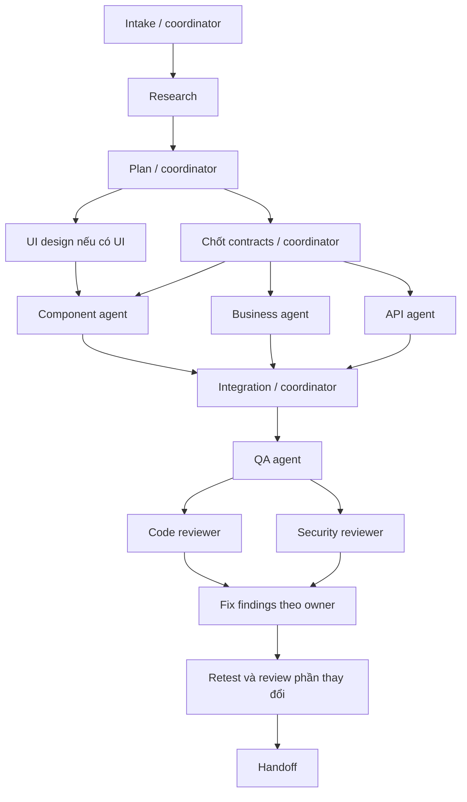

# Bank development workflow

Workflow này điều phối công việc trong `personal-finance-lab`, dùng rules đang được ghi trong repo. CI hiện có nằm ở `.github/workflows/ci.yml`; workflow agent bổ sung cách triển khai và review, không thay thế CI.

## Gọi command

```text
$bank feature thêm chức năng xuất lịch sử giao dịch theo bộ lọc hiện tại
$bank fix sửa lỗi bộ lọc mất trạng thái khi Back
$bank ui tạo component AccountPicker theo component rules
$bank api tích hợp endpoint danh sách người thụ hưởng theo OpenAPI được cung cấp
$bank review kiểm tra diff hiện tại về correctness và security
$bank verify kiểm tra thay đổi hiện tại
$bank plan thiết kế flow chuyển tiền định kỳ, chưa implement
$bank resume <run-id>
```

`/bank feature ...` là alias prompt do [AGENTS.md](../../AGENTS.md) định nghĩa khi host chuyển nguyên văn message tới agent. Đây không phải native slash command/autocomplete đã được extension đăng ký. Nếu UI chặn slash lạ, dùng `$bank ...` hoặc `Dùng bank workflow, mode feature: ...`. [Codex skill documentation](https://learn.chatgpt.com/docs/build-skills) mô tả discovery tại `.agents/skills` và invocation bằng `$` trong CLI/IDE; restart Codex nếu skill mới chưa xuất hiện. Skill này chỉ có scope repo, không đổi thiết lập cá nhân.

## Flow và trách nhiệm



Các mũi tên từ lane không áp dụng được bỏ qua và ghi lý do. Không spawn agent chỉ để chờ dependency. Role là trách nhiệm có brief riêng, không phải model được hardcode hay daemon chạy nền.

| Role               | Việc duy nhất / write scope mặc định                                                                                    | Brief                              |
| ------------------ | ----------------------------------------------------------------------------------------------------------------------- | ---------------------------------- |
| Coordinator        | Intake, plan, contracts, page/composable wiring, feature logic/recovery helpers, shared config, run record, integration | Quy trình bên dưới                 |
| Research           | Đọc repo/tài liệu, xác định impact; không sửa code                                                                      | [research](agents/research.md)     |
| UI designer        | Đặc tả interaction/component states; không sửa runtime                                                                  | [design](agents/design.md)         |
| Component engineer | Presentational `.vue` trong components và stories được giao                                                             | [components](agents/components.md) |
| Business engineer  | `src/domain`, `src/use-cases` được giao                                                                                 | [business](agents/business.md)     |
| API engineer       | `src/data`, `server/api` được giao                                                                                      | [api](agents/api.md)               |
| QA engineer        | Test files/fixtures được giao, chạy kiểm chứng                                                                          | [qa](agents/qa.md)                 |
| Code reviewer      | Đọc diff + caller/test, phát hiện regression; không sửa code                                                            | [review](agents/review.md)         |
| Security reviewer  | Kiểm tra trust boundaries của thay đổi; không sửa code                                                                  | [security](agents/security.md)     |

Mỗi lần dispatch dùng agent thực qua API delegation có sẵn, truyền brief tương ứng. Không cần tự tạo task sidebar. Một người có thể điều phối nhiều giai đoạn nhưng reviewer không phải agent đã viết phần code đó. Với giới hạn 4 slot, coordinator giữ 1 slot, tối đa 3 worker; runtime ít hơn thì giảm số worker. Không đổi model/settings để ép chạy. Nếu không có delegation, công bố chạy tuần tự và self-review, không ghi đã có independent review.

## Routing

| Mode      | Flow / điểm dừng                                                                                                         |
| --------- | ------------------------------------------------------------------------------------------------------------------------ |
| `feature` | Toàn flow; bỏ UI hoặc API/business lane nếu không liên quan, ghi lý do                                                   |
| `fix`     | Reproduce → xác định nguyên nhân → plan nhỏ → owner sửa → regression test → review/security → retest                     |
| `ui`      | Research → design → component/story → wiring nếu cần → UI/visual QA → review/security theo phạm vi                       |
| `api`     | Research contract → xác định auth/error/idempotency → API/business nếu cần → wiring → contract/SSR/E2E → review/security |
| `review`  | Chốt phạm vi diff → code + security review độc lập → findings. Không tự sửa                                              |
| `verify`  | Chọn test matrix → chạy checks hiện có → evidence. Không sửa source hay update baselines                                 |
| `plan`    | Research → design khi cần → plan/contracts/test map → trả plan. Không implement                                          |
| `resume`  | Đọc run record → kiểm tra working tree và evidence cũ → tiếp tục bước còn thiếu                                          |

Đối với đổi typo/docs nhỏ, coordinator có thể xử lý trực tiếp và check format/links. Không cần full pipeline hoặc test ứng dụng không liên quan.

## Thực thi và gates

1. **Intake.** Đọc AGENTS và rule sources liên quan; xác nhận đúng repo. Ghi trạng thái git ban đầu, request, acceptance criteria có thể kiểm chứng, assumptions, phạm vi loại trừ, mode và rủi ro. Chỉ hỏi dữ kiện đang chặn quyết định; tiếp tục phần độc lập. Không tự suy đoán API/auth chưa được cung cấp.
2. **Research.** Giao agent đọc code/callers/tests và tài liệu được tham chiếu. Dùng official docs khi cần kiểm tra hành vi thư viện hiện tại. Không gửi source/private data lên search. Kết quả là file map, reuse candidates, rule conflicts, unknowns.
3. **Plan.** Coordinator lập dependency graph, file ownership, acceptance → test mapping. Chốt types/errors/query keys và UI props/emits/slots trước khi các writer chạy song song. Plan đủ cụ thể để review nhưng không mặc định chờ approval cho các bước triển khai đã được yêu cầu. Mode `plan` hoàn tất cả đặc tả design ở bước 4 nếu có UI rồi trả plan, không chạy implementation.
4. **Design.** Nếu có UI, ghi component tree, trạng thái/loading/error/empty/success/busy, keyboard/focus, responsive và theme. Tái sử dụng design system hiện có. Design UI là một giai đoạn công việc, không giả định có tool `.design` hay Figma. Tạo story/prototype trong phạm vi được giao nếu cần minh chứng.
5. **Implement.** Dispatch lane đủ dependency. Mỗi agent chỉ sửa file được giao; muốn sửa shared contract phải báo coordinator. Coordinator kiểm tra output và tích hợp pages/composables/plugins sau khi lane bàn giao. Không cho hai agent ghi cùng file hoặc chạy build/format vào cùng output directory đồng thời.
6. **QA.** Dùng [test matrix](testing.md). Ghi command, exit code, phạm vi/assertions, artifact path và hạn chế môi trường. Test thất bại trước task phải phân biệt bằng evidence, không tự nhận là lỗi có sẵn. Không dùng fixture pass để kết luận production banking pass.
7. **Review.** Sau integration và QA, code/security reviewers đọc cùng diff hiện tại, gồm file mới. Mỗi finding có severity, file/line, trigger, impact, evidence và hướng sửa. P0/P1 chưa giải quyết chặn trạng thái ready; P2 ảnh hưởng acceptance cũng chặn. Findings ngoài phạm vi được báo riêng, không tự mở rộng implementation.
8. **Remediate.** Gửi findings về đúng owner; chỉ reviewer xác minh fix, QA chạy lại boundary bị ảnh hưởng. Sau 2 vòng cùng lỗi mà không có tiến triển, ghi nguyên nhân/blocker, tiếp tục phần độc lập và hỏi dữ kiện cụ thể nếu cần. Không lặp vô hạn, không báo hoàn tất khi gate còn fail.
9. **Handoff.** Tóm tắt thay đổi, evidence tests, review/security findings đã xử lý/còn lại, limitations và bước tiếp theo nếu blocked. Cập nhật docs liên quan, không viết lại số test lịch sử như thể vừa chạy. Không tự deploy/merge/push.

## Handoff giữa agents

Coordinator truyền một work packet trước khi spawn:

```text
Task/mode + acceptance criteria:
Role brief + relevant rule sources:
Inputs/contracts đã chốt:
Exact files được phép sửa (hoặc read-only):
Dependencies đã hoàn thành:
Test expectations và các command/output cần tránh chạy đồng thời:
Existing user edits cần giữ:
Return: files changed, decisions, checks + results, blockers, next owner.
```

Agent trả kết quả thật, không đánh dấu bước tiếp theo đã xong. Coordinator giữ quyền sở hữu shared files cho tới khi giao đích danh. Khi caller/contracts thay đổi, thông báo tất cả consumer; chờ cập nhật trước integration. Dùng cùng checkout khi file ownership không giao nhau, hoặc worktree khi thật sự cần isolation và runtime cho phép.

## Run record và resume

Với task nhiều giai đoạn, coordinator lưu một file Markdown dưới `.local-notes/workflows/<run-id>.md` (đã được Git ignore). Chọn ID ngắn từ tên task, tránh ghi đè run cũ. Đây là trạng thái local, không phải audit log chia sẻ của CI.

Ghi: request/mode; initial git status; acceptance criteria; assumptions; plan; role/agent ID/file ownership; contracts/design; stage status (`pending`, `running`, `passed`, `failed`, `blocked`, `skipped` kèm lý do); handoffs; test commands/results/artifacts; review findings; next action. Không lưu secrets hoặc thông tin tài khoản thật.

Khi resume, đọc record và diff hiện tại; evidence chỉ còn giá trị khi code/config liên quan chưa đổi. Retest phần thay đổi, không chạy lại mọi thứ chỉ vì mở task mới. Chỉ coordinator ghi record để tránh xung đột.

## Definition of done

Acceptance đã có evidence; import/component/banking invariants giữ nguyên; checks bắt buộc theo matrix pass; review findings được xử lý hoặc ghi rõ lý do chưa ready; docs/API examples liên quan đồng bộ; không làm mất user edits. Báo riêng `implemented`, `verified`, `ready` nếu môi trường chặn kiểm chứng. Không gọi code production-secure chỉ vì demo tests hoặc checklist đã pass.
